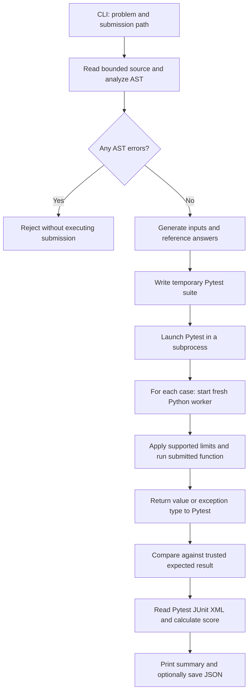

# Automated AI Code Evaluator & Test Generator

A small Python project using **Python, Pytest, AST, and subprocess**, matching the technologies in the supplied project description.

Give it a Python solution to a supported coding problem. It checks the source, generates tests, executes each input in a separate process, and produces a score with useful feedback. This single file explains the entire project: installation, commands, internals, examples, limitations, and extension points.

“AI” describes the code being evaluated: you can paste a solution from an AI assistant into a `.py` file and grade it. **This project does not call an LLM or require an API key.** Test generation is deterministic and based on explicit problem contracts and trusted reference functions. Human-written submissions work too.

## 1. What the project includes

- Three exercises: sum of even numbers, palindrome checking, and binary search.
- AST checks for syntax, required functions, restricted operations, and suspicious patterns.
- Fixed edge cases, malformed inputs, one larger input per problem, and seeded random tests.
- Real Pytest test generation and execution.
- A fresh subprocess and wall-clock deadline for every test input.
- CPU limits on supported Unix systems and a memory/address-space cap on Linux.
- Scores, category breakdowns, failure reasons, source fingerprints, and JSON reports.
- Correct, buggy, nonterminating, and disallowed example submissions.
- Automated tests for the evaluator itself.

This is an educational local evaluator. Its subprocesses and AST restrictions are **not a security sandbox for hostile submissions**. See section 10 for the exact limits.

## 2. Technologies and their roles

| Technology | What it does here |
| --- | --- |
| Python 3.10+ | CLI, problem definitions, reference answers, test data, report generation |
| Pytest 8 or 9 | Runs generated, parametrized test functions and writes machine-readable JUnit XML |
| `ast` | Parses submissions without importing them; checks the structure and reports suspicious patterns |
| `subprocess` | Starts the Pytest runner and separate Python workers; enforces wall-clock deadlines |
| Standard library helpers | `random` for reproducible cases, `json` for messages/reports, `tempfile` for working directories, `resource` for supported OS limits |

Pytest is the only application dependency. Setuptools builds/installs the package. There is no database, web server, external AI service, or frontend to configure.

## 3. Setup and first run

Open a terminal in the `ai-code-evaluator` project folder.

### macOS / Linux

```bash
python3 -m venv .venv
source .venv/bin/activate
python -m pip install -e .
python -m ai_evaluator list
python -m ai_evaluator evaluate sum-even examples/sum_even_correct.py
```

### Windows PowerShell

```powershell
python -m venv .venv
.\.venv\Scripts\Activate.ps1
python -m pip install -e .
python -m ai_evaluator list
python -m ai_evaluator evaluate sum-even examples/sum_even_correct.py
```

If PowerShell does not allow activation, use `.\.venv\Scripts\python.exe` in place of `python` in subsequent commands. Keep using the same virtual environment for installation, evaluation, and testing.

The installed shortcut `ai-evaluator` is equivalent to `python -m ai_evaluator`. Installation needs access to package dependencies; evaluation itself works offline.

The correct sum example should start with:

```text
PASSED | 100.00/100 | 26/26 tests passed
```

## 4. A short demonstration

Run these commands separately. Failed submissions deliberately return a nonzero exit code, so do not connect the demonstration commands with `&&`.

```bash
# Correct solution, with a saved report.
python -m ai_evaluator evaluate sum-even examples/sum_even_correct.py --report reports/correct.json

# Looks plausible but mishandles negative even numbers and some malformed inputs.
python -m ai_evaluator evaluate sum-even examples/sum_even_buggy.py --report reports/buggy.json

# Often finds the target, but returns the wrong index when duplicates exist.
python -m ai_evaluator evaluate binary-search examples/binary_search_buggy.py

# Completes grading even though every submitted function call loops forever.
python -m ai_evaluator evaluate sum-even examples/sum_even_infinite.py --timeout 0.2 --random-cases 0

# Finds an import-policy violation before running the submission.
python -m ai_evaluator analyze sum-even examples/sum_even_disallowed.py

# Other correct solutions.
python -m ai_evaluator evaluate palindrome examples/palindrome_correct.py
python -m ai_evaluator evaluate binary-search examples/binary_search_correct.py
```

These default-seed results were observed during development:

| Submission | Outcome | Score |
| --- | --- | --- |
| `sum_even_correct.py` | 26 of 26 passed | 100.00 |
| `sum_even_buggy.py` | 10 of 26 passed | 38.46 |
| `binary_search_buggy.py` | 25 of 28 passed | 89.29 |
| `sum_even_infinite.py`, random cases disabled | 14 timeouts | 0.00 |
| `sum_even_disallowed.py` | AST rejection; no cases executed | 0.00 |

Saved examples of the first three reports are in `demo_reports/`. Durations vary by machine. Random-case results can change when you change the seed or case count.

## 5. Supported problem contracts

The evaluator needs a contract to know what “correct” means. Save one solution in a UTF-8 `.py` file and define the required function. Helper functions are allowed. Do not include command-line input, imports, a `main` block, classes, or module-level assignments.

### `sum-even` → `sum_even(numbers)`

Return an **integer** equal to the sum of all even integers, including negative values and zero.

```python
sum_even([1, 2, 3, 4])  # 6
sum_even([-6, -3, -2])  # -8
sum_even([])            # 0
```

The input must be a list whose elements have exact type `int`. Raise `TypeError` for other inputs, including floats and booleans. Although Python treats `bool` as an integer subclass, this problem intentionally excludes it.

### `palindrome` → `is_palindrome(text)`

Return an exact **bool** after this normalization: keep each original character for which `str.isalnum()` is true, lowercase each retained character using `str.lower()`, then join the results. Compare the resulting string with its reverse. Empty normalized strings are palindromes.

```python
is_palindrome("A man, a plan, a canal: Panama!")  # True
is_palindrome("hello")                          # False
is_palindrome("!")                              # True
```

Raise `TypeError` for non-strings. Unicode follows Python's character rules; no accent stripping, grapheme handling, or `casefold()` is applied. For example, `"İxİ"` becomes `"i\u0307xi\u0307"`, which is not a palindrome at the code-point level.

### `binary-search` → `binary_search(numbers, target)`

Return the **first matching index** as an exact integer, or `-1` if the target is absent. The list must be sorted in ascending, nondecreasing order.

```python
binary_search([1, 2, 2, 2, 3], 2)  # 1
binary_search([1, 3, 5], 4)        # -1
binary_search([], 7)               # -1
```

Raise `TypeError` unless `numbers` is a list of exact integers and `target` is an exact integer; booleans are excluded. After checking types, raise `ValueError` if the list is unsorted.

The example's search phase is O(log n), but validation scans the list, so the complete function is O(n). The evaluator grades the contract and observed runtime; it does not prove that a submission implements binary search or has a particular asymptotic complexity.

## 6. Generating a test file

```bash
python -m ai_evaluator generate sum-even examples/sum_even_correct.py --output generated/test_sum_even.py --seed 42
python -m pytest generated/test_sum_even.py -v
```

The generator first performs AST validation, then writes a runnable test file containing:

1. A snapshot of the submission's source code.
2. The expected function name.
3. Generated inputs and expected values or exception types.
4. One parametrized Pytest test that invokes the subprocess runner for each case.

**Regenerate the file after editing a submission.** An existing generated file continues to test its embedded snapshot. Exporting tests intentionally makes their inputs and answers visible. The generated suite requires this package to be installed because it imports `ai_evaluator.runtime`.

The included `demo/test_sum_even_generated.py` contains 14 fixed cases and can be run directly:

```bash
python -m pytest demo/test_sum_even_generated.py -q
```

The default evaluator runs 12 additional random cases per problem. Use `--random-cases 0` for fixed cases only. “Stress” here means one bounded larger input, not a comprehensive performance benchmark.

| Problem | Fixed cases | Default random cases | Default total |
| --- | --- | --- | --- |
| Sum even | 14 | 12 | 26 |
| Palindrome | 16 | 12 | 28 |
| Binary search | 16 | 12 | 28 |

## 7. How everything works internally



### Step 1 — Read and inspect the code

`analysis.read_source()` reads at most 64 KiB. `analyze()` builds an AST and compiles it without executing it to catch syntax problems. It verifies that exactly one top-level function has the required name and positional argument count.

Errors reject the submission: imports, executable module-level statements, forbidden names such as `open`/`eval`/`exec`, private attribute access, decorators, nonliteral defaults, classes, generators using `yield`, and async code. Comprehensions and generator expressions such as `sum(x for x in numbers)` are allowed.

Warnings report constant-true loops, direct recursion, and nested loops/comprehensions. A warning does not reduce the score: `while True` with a valid `break` can be correct. AST analysis does not reliably identify all logic errors, all recursion, infinite loops, or time/space complexity.

### Step 2 — Generate tests from the contract

`problems.generate_cases()` combines handwritten normal, boundary, malformed, and larger inputs with random valid inputs. A local `random.Random(seed)` instance makes cases reproducible without changing global random state.

`reference()` computes expected values. If the reference raises `TypeError` or `ValueError`, the case records the required exception type instead. Binary search uses a straightforward linear reference answer so the oracle does not duplicate the submitted binary-search algorithm.

Generation depends on the selected problem, seed, and case count—not on the submission's implementation. Therefore a buggy submission cannot teach the generator its own wrong answers.

### Step 3 — Produce and run real Pytest tests

`generator.render_suite()` emits Python test source with `pytest.mark.parametrize`. `evaluator.evaluate()` writes it to a temporary directory and launches `python -I -B -m pytest` there.

The runner disables automatic third-party Pytest plugin loading and project `conftest.py` discovery, uses its own configuration, and requests JUnit XML. The temporary suite holds the expected answers. The candidate code is not imported into this Pytest process.

### Step 4 — Execute one input in one worker

For every test, `runtime.run_case()` creates an empty temporary working directory and starts `worker.py` with `python -I -B -S`.

- `-I` enables Python isolated mode; `-B` prevents bytecode-cache writes; `-S` skips site initialization in the worker.
- The worker environment is rebuilt without inherited application credentials or `PYTHONPATH`.
- JSON over standard input carries only the source, function name, current arguments, and requested limits. Expected answers and other cases are not sent.
- Supported OS resource limits are applied before compiling/executing the submission.
- Execution uses a restricted builtins dictionary with ordinary algorithm helpers and common exception types. Source annotations are deferred using future-annotations compilation.
- The worker calls the required function and sends back a JSON scalar or exception type. Submission prints are discarded.
- Every case starts a fresh interpreter, so input mutation and module state do not carry over.

The parent enforces a wall-clock timeout that includes worker startup, source compilation, execution, and result transfer. On timeout it kills/reaps the worker; on POSIX it kills that worker's process group. Grading continues with the next case.

### Step 5 — Compare outside the worker

`runtime.run_case()` compares the observed answer with the expected one in the trusted Pytest process. Both **value and exact type** must match. Returning `True` does not pass a test expecting integer `1`.

Malformed-input tests require the exact expected exception name. Exception messages are ignored. Unexpected exceptions, unsupported returns, resource failures, and timeouts fail the case. Supported scalar returns are bounded; oversized strings/integers and nonfinite floats are rejected. The built-in contracts require only integers or booleans.

### Step 6 — Build the grade

Each generated test attaches a structured result with Pytest's `record_property` fixture. Pytest asserts that the case passed and writes JUnit XML using its `xunit1` format.

`evaluator.py` checks that every expected case appears exactly once and that Pytest's verdict matches the recorded result. Missing or inconsistent results become an engine error instead of a misleading score.

```text
score = round(100 × passed_cases / total_generated_cases, 2)
```

Each case has equal weight. An AST rejection gets zero with `executed: 0`; warnings are advisory. A 100 score means all generated cases passed, not a proof of correctness for all possible inputs.

## 8. Reports, options, and exit codes

```bash
python -m ai_evaluator evaluate sum-even examples/sum_even_correct.py --seed 7 --random-cases 20 --timeout 2 --memory-mb 256 --report reports/result.json
python -m ai_evaluator --help
python -m ai_evaluator evaluate --help
```

| Option | Default | Meaning |
| --- | --- | --- |
| `--seed` | `42` | Reproduce the random cases |
| `--random-cases` | `12` | Additional valid random cases; 0–100 |
| `--timeout` | `1.0` | Wall-clock seconds per worker; 0.05–30 |
| `--memory-mb` | `256` | Linux worker address-space cap in MiB; 64–2048 |
| `--report` | No file | Write a JSON report for `evaluate` |
| `--output` | Required for `generate` | Export a file named `test_*.py` |

Output directories are created automatically. Existing output files are replaced; the CLI prevents an output path from replacing the submission itself.

The JSON report records the problem, submission filename, SHA-256 source fingerprint, evaluator version, seed, random-case count, overall status, score, executed/pass/total counts, AST findings, category scores, and per-case results. Durations include process overhead; they are not pure algorithm benchmarks.

Per-case `limits` reports what the worker successfully applied. A worker killed before responding cannot return this information. Top-level `requested_limits` records the configuration; `memory_limit_supported` reports the platform capability, not measured memory use.

| Status | Meaning |
| --- | --- |
| `passed` | Every generated case passed |
| `failed` | At least one case failed, timed out, or had a runtime problem |
| `rejected` | AST preflight prevented execution |
| `engine_error` | Pytest/protocol/resource-setup failure; the grade is not a reliable submission assessment |

Exit code **0** means success, **1** means rejection or test failure, and **2** means invalid CLI input or an evaluator/environment error. `analyze` succeeds with warnings. `generate` succeeds when it writes a valid suite; it does not grade the submission.

## 9. File-by-file map and tests

```text
ai-code-evaluator/
├── README.md                         # This complete guide
├── pyproject.toml                    # Dependencies, package setup, CLI entry point
├── src/ai_evaluator/
│   ├── __init__.py                   # Package version
│   ├── __main__.py                   # python -m ai_evaluator entry point
│   ├── cli.py                        # Commands, arguments, console output
│   ├── problems.py                   # Contracts, reference functions, test data
│   ├── analysis.py                   # Source-size guard and AST inspection
│   ├── generator.py                  # Pytest source generation
│   ├── evaluator.py                  # Evaluation orchestration and grading
│   ├── runtime.py                    # Worker lifecycle, timeout, comparison
│   └── worker.py                     # Applies limits and executes one input
├── examples/                         # Correct and intentionally broken submissions
├── demo/test_sum_even_generated.py    # Ready-to-run exported test suite
├── demo_reports/                      # Saved sample JSON grades
└── tests/                            # Tests of the evaluator itself
```

Run the project's tests with:

```bash
python -m pytest -q
```

These tests check AST rejections, warning behavior, deep source expressions, oracle answers, deterministic generation, precise return/exception types, output handling, mutation isolation, timeouts, grading, exported suites, CLI reports, and overwrite protection. They launch real Pytest and worker processes for end-to-end coverage.

All **56 automated tests passed** locally using **Python 3.14.5 and Pytest 9.1.1 on macOS**. Linux-specific memory enforcement and Windows execution have not been tested in that local run. Python 3.10+ is the declared compatibility target.

## 10. Isolation, hidden tests, and practical limits

| Mechanism | What it provides | What it does not establish |
| --- | --- | --- |
| AST restrictions and limited builtins | Catch common disallowed operations and keep exercises simple | A complete defense against Python sandbox escapes |
| Separate process and temporary directory | Separate interpreter state and working files for ordinary submissions | Filesystem, network, user-account, or kernel isolation |
| Wall timeout | Stops nontermination within the configured execution budget | Proof that a loop is infinite or an algorithm has a specific complexity |
| Unix CPU limit | A second execution cap where the OS supports it | An OS-independent CPU guarantee |
| Linux `RLIMIT_AS` | Caps worker virtual address space, including interpreter overhead | Portable memory enforcement or O(n)/O(1) space analysis |
| Fresh worker for each case | Prevents ordinary shared state between tests | Complete cleanup/containment of arbitrary hostile descendant processes |

On macOS and Windows, this implementation does **not** enforce the requested memory cap. It reports that limitation. CPU limits use the Unix `resource` API where available; the wall timeout is the portable primary control. Supported limits that fail to apply produce an environment error. There is also a whole-evaluation deadline of `number_of_cases × (timeout + 1) + 15` seconds.

The default summary and JSON report omit inputs and expected answers. Cases are withheld from the worker except for the current input, and temporary suites are deleted after evaluation. However, the reference code and default seed are in this project, a local user can inspect generated data, and exported test files reveal it deliberately. “Hidden” here means withheld during ordinary submission execution/reporting, not secret from someone who controls the evaluator machine.

Use reviewed educational submissions locally. A service accepting unknown users' code needs a separate containment layer such as hardened disposable containers or VMs, restricted filesystem/network access, and OS-enforced resource/process controls. This small project does not implement that layer.

## 11. Adding a new problem

1. Add a `Problem` entry in `problems.PROBLEMS`, giving its key, function name, parameter names, and contract.
2. Extend `reference()` with an independently understandable oracle and explicit malformed-input behavior.
3. Extend `generate_cases()` with representative, boundary, malformed, larger, and random inputs. Avoid relying only on random tests.
4. Add one correct and at least one plausible buggy submission in `examples/`.
5. Test known oracle outputs and end-to-end grades in `tests/`, then document the contract here.

The existing runner supports JSON-serializable arguments and bounded scalar results. Problems requiring lists, custom objects, tolerant floating-point comparison, multiple valid answers, or interactive I/O need an intentional extension of the transport/comparison contract. An LLM-based suggestion generator could be added later, but its tests would still need trusted validation before they influence a grade.

## 12. Troubleshooting

- **`No module named ai_evaluator` or `pytest`:** activate the virtual environment and run `python -m pip install -e .` from the project root.
- **A correct solution fails malformed cases:** check that it explicitly rejects booleans, wrong argument types, or unsorted lists as the selected contract requires.
- **Very short timeouts fail on a slow machine:** startup is included; increase `--timeout` to 2 seconds and rerun. Timing failure alone does not diagnose the cause.
- **An edited solution seems unchanged in exported tests:** regenerate the suite because it contains a source snapshot.
- **An import/helper operation is rejected:** submissions use the deliberately small pure-Python policy in `analysis.py` and the builtins available in `worker.py`.
- **Memory cap unavailable:** this is expected on macOS/Windows for this implementation; see section 10.

## 13. Primary documentation

The implementation uses Python's AST interfaces for source inspection; see the [Python AST documentation](https://docs.python.org/3/library/ast.html). Child creation, communication, and timeout handling use the [Python subprocess API](https://docs.python.org/3/library/subprocess.html). Supported Unix limits come from [Python's resource module](https://docs.python.org/3/library/resource.html). The test engine uses [Pytest invocation and reporting](https://docs.pytest.org/en/stable/how-to/usage.html).
